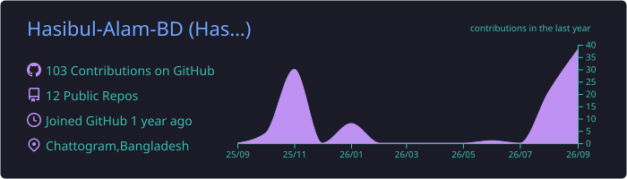
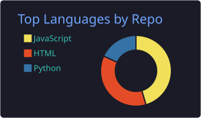
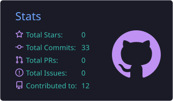
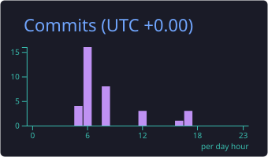

  

  

  
  
  
  

  
  
  
  
  

---

### 💫 About Me

- 🎓 **Education:** B.Sc. in Computer Science & Engineering (CSE Undergrad)
- 💻 **Roles & Expertise:** Full-Stack Web Developer • SEO Specialist • Digital Marketing & Social Media Specialist
- 🤖 **Tech Exploration:** Artificial Intelligence (AI) & Machine Learning (ML)
- 🚀 **Currently Exploring:** Next.js 14, AI Integrations, SEO Optimization & Full-Stack Architectures
- 💬 **Ask Me About:** React, Node.js, Python, SEO Ranking, Social Media Growth, Digital Marketing
- ⚡ **Fun Fact:** Merging technical development with data-driven marketing to build high-ranking web products 🚀📈

---

### 🛠️ Languages, Tech & Marketing Skills

  <strong>⚡ Web Development & Programming</strong> 
  

  <strong>⚡ AI/ML & Digital Marketing Expertise</strong> 
  
  
  
  

---

### 📊 GitHub Activity & Analytics

  
  

  
  

---

### 🌟 Featured Projects

<table>
  <tr>
    <td width="50%" valign="top">
      <h3 align="center">🚀 Adaura - NextGen Agency</h3>
      

        A premium logistics, shipping, and parcel delivery platform with a responsive glassmorphic UI and real-time tracking features.
      

      

        <code>JavaScript</code> • <code>HTML5</code> • <code>CSS3</code> • <code>Glassmorphism</code>
      

      

        
      

    </td>
    <td width="50%" valign="top">
      <h3 align="center">🎓 Faith Coaching Home</h3>
      

        A comprehensive and modern responsive educational management website built for an academic coaching center.
      

      

        <code>React</code> • <code>TailwindCSS</code> • <code>JavaScript</code> • <code>Responsive UI</code>
      

      

        
        &nbsp;
        
      

    </td>
  </tr>
  <tr>
    <td width="50%" valign="top">
      <h3 align="center">💼 Personal Portfolio</h3>
      

        Interactive developer portfolio highlighting skills, experience, projects, and direct contact options.
      

      

        <code>HTML5</code> • <code>CSS3</code> • <code>JavaScript</code> • <code>Animations</code>
      

      

        
        &nbsp;
        
      

    </td>
    <td width="50%" valign="top">
      <h3 align="center">📝 Xenon To-Do App</h3>
      

        A productivity task manager app with real-time state management, intuitive UI, and persistent storage.
      

      

        <code>JavaScript</code> • <code>Web Storage</code> • <code>CSS3</code>
      

      

        
      

    </td>
  </tr>
</table>

  

